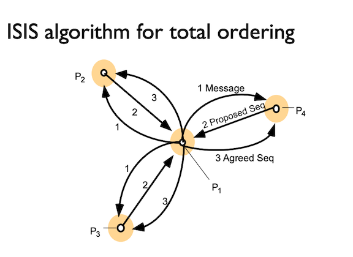
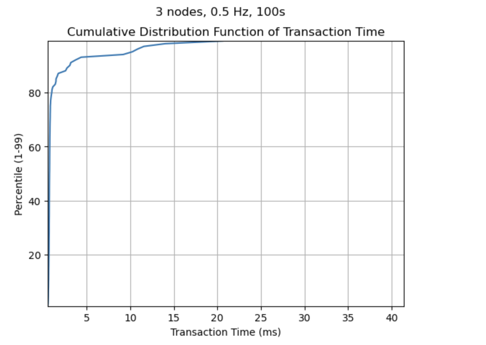
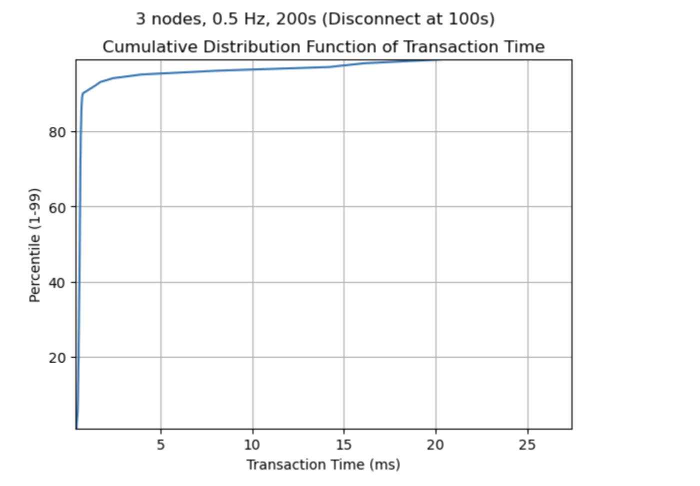
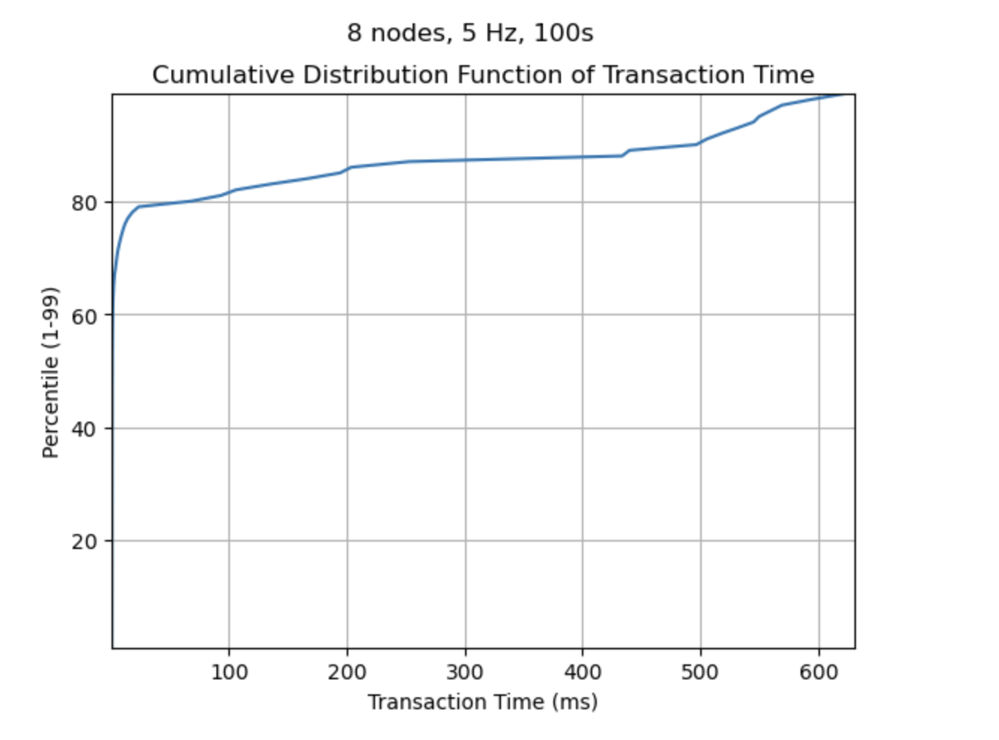
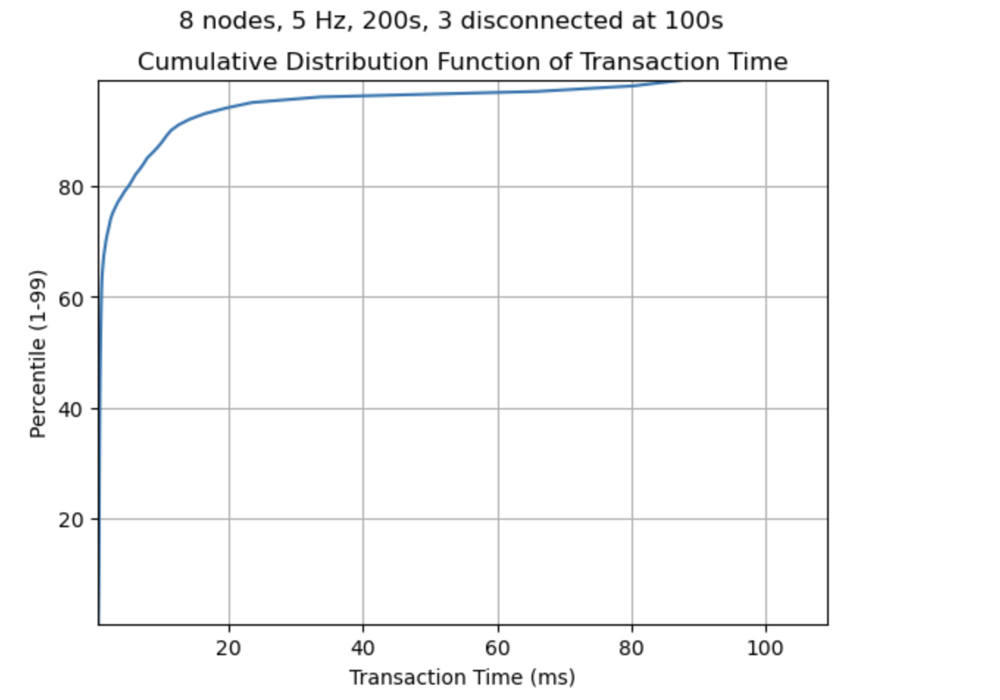

# Distributed Transaction Logger 
James Rockey



## Overview
The Distributed Transaction Logger is an innovative system designed to maintain a total ordering of transactions across distributed nodes using the [ISIS Algorithm](https://apps.dtic.mil/sti/pdfs/ADA166770.pdf). Developed in Go, this project aims to provide a robust solution for tracking transactions in a distributed environment, ensuring consistency and reliability in transaction logging.


## Key Features
- **Total Ordering of Transactions**: Ensures that transactions are ordered across all nodes in the system, providing a consistent view of transactions.
- **Distributed Consistency**: Utilizes the ISIS algorithm for achieving consensus among distributed nodes, ensuring that all nodes agree on the sequence of transactions.
- **Fault Tolerance**: Designed to handle node failures gracefully, maintaining the system's operational integrity and reliability.
- **Scalability**: Efficiently manages an increasing number of transactions and nodes, making it suitable for large-scale distributed systems.
- **Transaction Tracking**: Offers comprehensive tracking capabilities, enabling users to monitor the status and history of each transaction across the network.


## Intended Use Cases
This system is particularly suited for applications requiring accurate and consistent logging of transactions in a distributed setting, such as:
- Financial systems for tracking payments or transfers.
- E-commerce platforms for managing order processing.
- Distributed databases that need to maintain a consistent state across multiple nodes.
- Any application requiring a reliable record of transactions in a distributed environment.


## Getting Started

### Prerequisites
- Go 1.15 or later.

### Installation
Clone the repository and build the project:
```bash
git clone https://github.com/yourusername/Distributed-Transaction-Logger.git
cd Distributed-Transaction-Logger
```

Building the program run this:

```bash
make
```


## Running the Code

The first step is initializing all nodes in the system. The file config.yaml specifies the locations and ports of other servers in this system. 

The first line of the configuration file specifies the number of nodes in the system. Each subsequent line provides a unique identifier for each node, followed by its address and the port it is listening on. By default, we have preset three nodes (node1, node2, node3) to run on localhost with different ports to simulate a distributed environment on a single machine. This setup is intended as an example, and you're encouraged to modify the configuration according to your own network topology or testing requirements. 
Example setup:
```bash
3
node1 0101.cs.illinois.edu 1234
node2 0102.cs.illinois.edu 1234
node3 0103.cs.illinois.edu 1234
```


To run the system, initialize each transaction node in a new terminal. Run the command: 

```bash
./isis_txn_node <identifier> <configuration file> 
```

Once all nodes on the system are online, you can begin committing transactions between them.

The system accepts two commands:

```bash
DEPOSIT [Amount] [User]
TRANSFER [User1] -> [User2] [Amount]
```

Example:
```bash
DEPOSIT 100 James
TRANSFER James -> Neil 50
```

After each command, the current balances in the system are printed out to the terminal. The order of these messages is guaranteed to be the same at each process in the system.

## Testing
The file gentx.py generates valid transactions for the distributed system. To test how the system performs on these transactions you can pipe the results in to the program by running the command
```bash
python3 -u gentx.py 0.5 | ./isis_txn_node node1 config.yaml
```


## Design
This decentralized system is designed to provide dependable multicast messaging. Every node in the system functions as both a client and a server. By utilizing goroutines, each process can monitor all incoming connections from other nodes for new messages while simultaneously monitoring STDIN for incoming transactions.

The design follows the following R-Multicast and ISIS algorithm design:
* First, a message is created by a source node, in the form of a DEPOSIT or TRANSFER. The message then enters the ISIS algorithm for total ordering:
    1. The message is first added to the current processes priority queue with *Deliverable* set to false, and it’s priority equal to the maximum of all agreed priorities and previously proposed priorities. In our program this variable is called curr_priority. After adding to the priority queue, the message is b-multicast to every other alive node in the system. 
    2. On recieving a message that is not deliverable, a non-source node will first update it’s own priority queue with it’s own *curr_priority*. To distinguish between nodes and break ties, we added the server_id/10 to the *curr_priority*, where *server_id* is the index of the server in our array of connections. This is the non-source node’s proposed priority for the message. It then unicasts the message back to the source node with it's proposed *Priority*, which is held in a global variable *curr_priority*. 
    3. When a source node recieves a message with a proposed *Priority*, it will increment the *num_proposed* map for that message. Once *num_proposed* is equal to *alive_nodes*, the source node knows that it has received all proposed priorities for the message. The source node chooses the highest proposed priority, sets *Deliverable* to true, and updates its PriorityQueue with the delivered message and new max proposed priority. It then multicasts the deliverable message. 
    4. On receiving a message that is deliverable, a non-source node will update its priority queue and set its *curr_priority* equal to the max of the agreed priority and its current priority. It then scans the pop of the priority queue to see if messages are deliverable or if there is an error message. An error message is a message that occurs when the sender dies before multicasting a message with a final priority. These will get stuck at the front of the priority queue if not removed, and are distinguished by a bool called *Error*. Once the node pops a deliverable message, it b-delivers the message. This ensures that once a message is delivered by one node it should be delivered by all nodes.        
        
Any message delivered by a process will have an agreed priority from every node in the system, ensuring total ordering across the system.

By including a *Received* map, processes are able to keep track of all deliverable messages that they have received. This ensures that all messages that have been delivered by one correct process are delivered by all correct processes in the system. This is done by b-multicasting the message the first time it is received, to ensure all other live nodes in the system get the message and deliver it. This ensures reliable delivery to the application.

## Failure Detection
Each process in this system listens on a *decoder* and sends messages on an *encoder*. Process keep one of each for each node in slices called *[]decoders* and *[]encoders* respectively. When a process fails, this *decoder* recieves an EOF. When this happens, we set the *decoder* and *encoder* at that index in the slice to nil. Then, when looping through and listening on *[]decoders*, the process will see which other nodes are failed and stop listening on those channels. In addition, when looping through and sending messages in B-Multicast on *[]encoders*, the current process stops sending messages on channels attached to failed nodes.

In one final case, if a process dies before sending a deliverable message, i.e. 

1. source process sends message, deliverable is set to false
2. recieving process recieves message and adds it to its queue
3. source process dies

In this case, the undeliverable message gets pushed onto the recieving processes queue and will eventually sit at the front causing problems. To avoid this case each node checks if messages at the front of it's queue come from dead processes and pop them using an Error state in the Message Struct (but don't deliver them if they're not deliverable). 

Each node also keeps track of an *alive nodes* global variable, which is nessecary in the ISIS algorithm. When a process fails, we decrement *alive_nodes*. This way, each process only listens for the amount of live processes to return with a proposed priority.

As mentioned above, any node which recieves a deliverable message will multicast the message. This ensures that if a process delivers a message, half-multicasts, and fails, all other live processes will still deliver the message.  


## Performance Analysis and Results
To validate the efficiency and robustness of the Distributed Transaction Logger, we conducted a series of experiments measuring the system's performance under various operational scenarios. Below, we present the cumulative distribution function (CDF) graphs that illustrate the system's behavior when nodes send messages at different frequencies over a specified time interval. These scenarios were designed to mimic real-world conditions, testing the system's fault tolerance, scalability, and transaction processing speed.



Scenario 1: 3 nodes sending messages with frequency of 0.5 Hz each operating for 100s.
This scenario demonstrates the system's ability to maintain total ordering of transactions under normal operation conditions.



Scenario 2: 3 nodes sending messages with frequency of 0.5 Hz each operating for 200s, with one node disconnecting at 100s.
This scenario highlights the system's fault tolerance by introducing node failures and mieasuring the impact on message delivery.



The graph for Scenario 3 illustrates the transaction time distribution among 8 nodes operating at a high transaction frequency of 5 Hz over a short period of 100 seconds. The cumulative distribution function (CDF) indicates that the majority of transactions were completed swiftly, with a steep ascent in the curve within the lower transaction time range. This suggests that the system efficiently processed transactions across all nodes with minimal delay, showcasing its ability to handle increased load effectively. The gradual plateau towards the end of the curve reflects a small percentage of transactions that took longer, which might be attributed to network variability or processing overhead as the system scales.


In Scenario 4, the CDF graph shows the impact of node failures on the transaction time. Despite all nodes initially operating at a high frequency of 5 Hz, the disconnection of 3 nodes at the halfway mark (100 seconds) could have introduced potential delays. However, the CDF curve rises sharply and levels off quickly, which indicates that the remaining nodes were able to handle the ongoing transactions effectively without significant impact on the transaction times. This rapid leveling of the curve even after node failures demonstrates the system's resilience and its ability to maintain performance in the face of disruptions, ensuring reliable transaction processing continuity.
